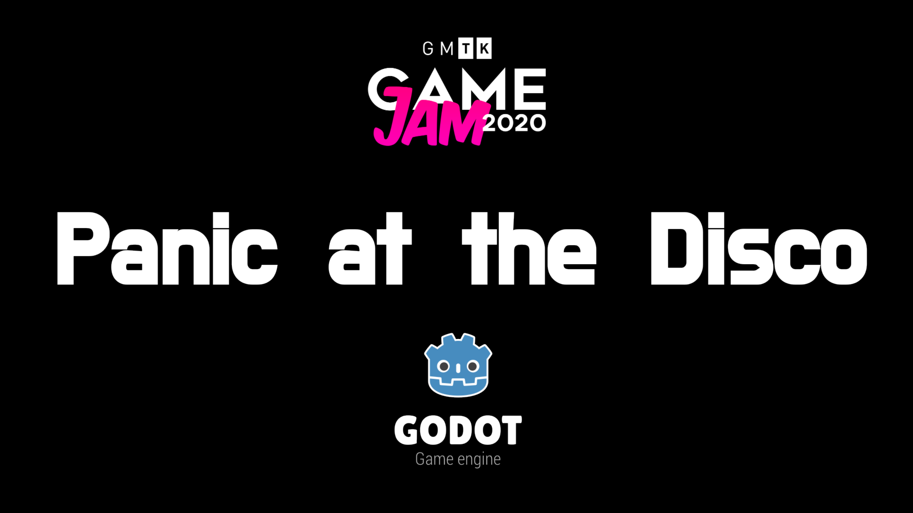
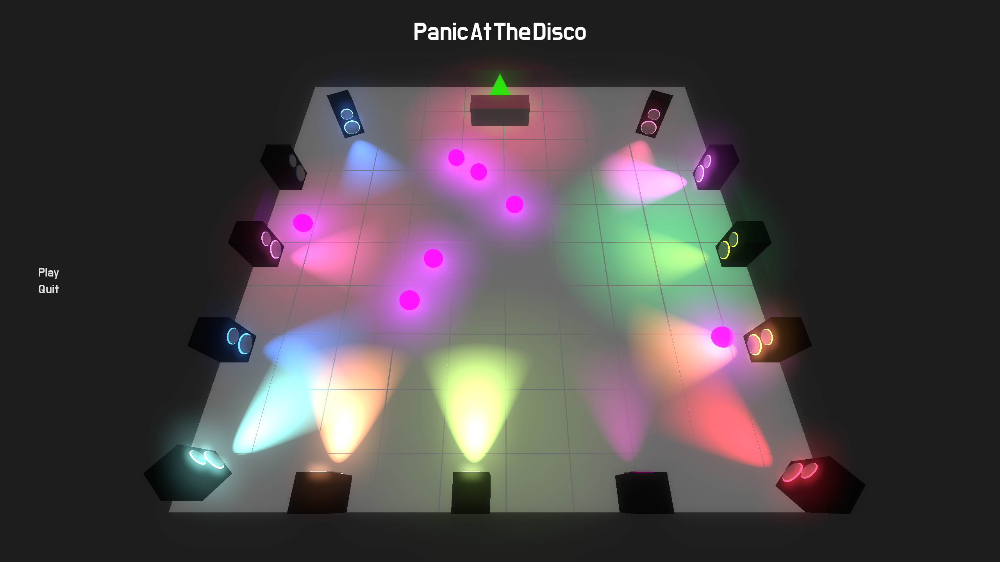
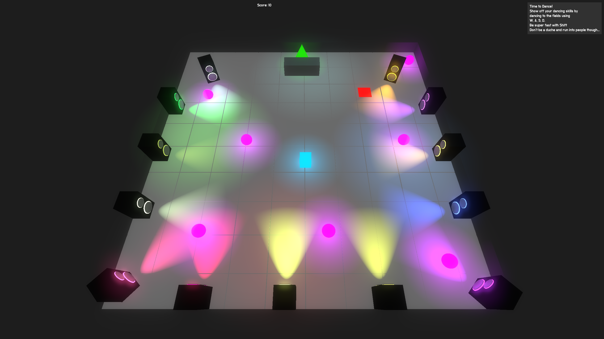

# Panic At The Disco
## A GMTK Game Jam Submission

This game was made for the [GMTK Game Jam 2020](https://itch.io/jam/gmtk-2020) which lasted for 48h.  
The game was made in roughly 20h by myself.  

Feel free to use all code and assets for your own Projects. Credits are not needed but welcome.

You can also find the game on [itch.io](https://chippmann.itch.io/panic-at-the-disco)

### Theme:

The theme of the game jam was "Out of control"

### Overview:

This is a short, fast paced, colorful action game in which you can try to get the HighScore.  
Master different challenges in 3 Stages which vary in difficulty and gameplay.  

#### Epilepsy warning:
This game contains many fast flashing lights in different colors. 

### Developing:
One needs the GodotEngine in version 3.2.2 (other Versions might work but were not tested) to build this game.

### Credits:

Music was generated using [EcrettMusic](https://ecrettmusic.com) which is a AI Music generator.  
The soundtrack for the last Stage was taken from [OpenGameArt](https://opengameart.org/content/fast-fight-battle-music) and was provided by [Ville Nousiainen](http://soundcloud.com/mutkanto) and looped by me  
All other assets were created directly in the [Godot Game Engine](https://godotengine.org/)

### Screenshots:
  
  
